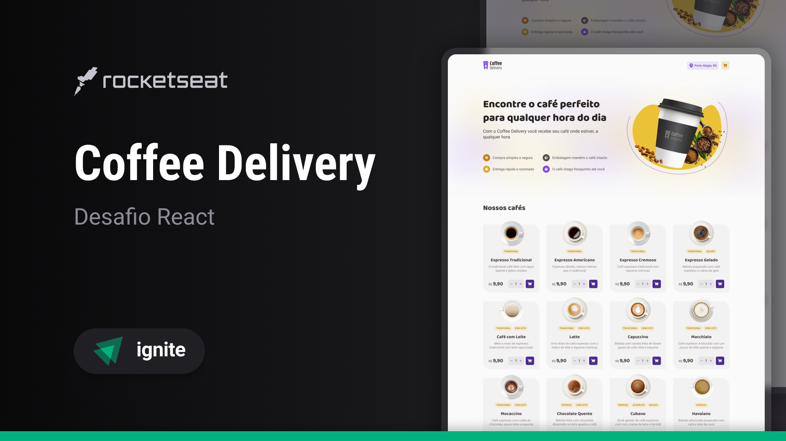
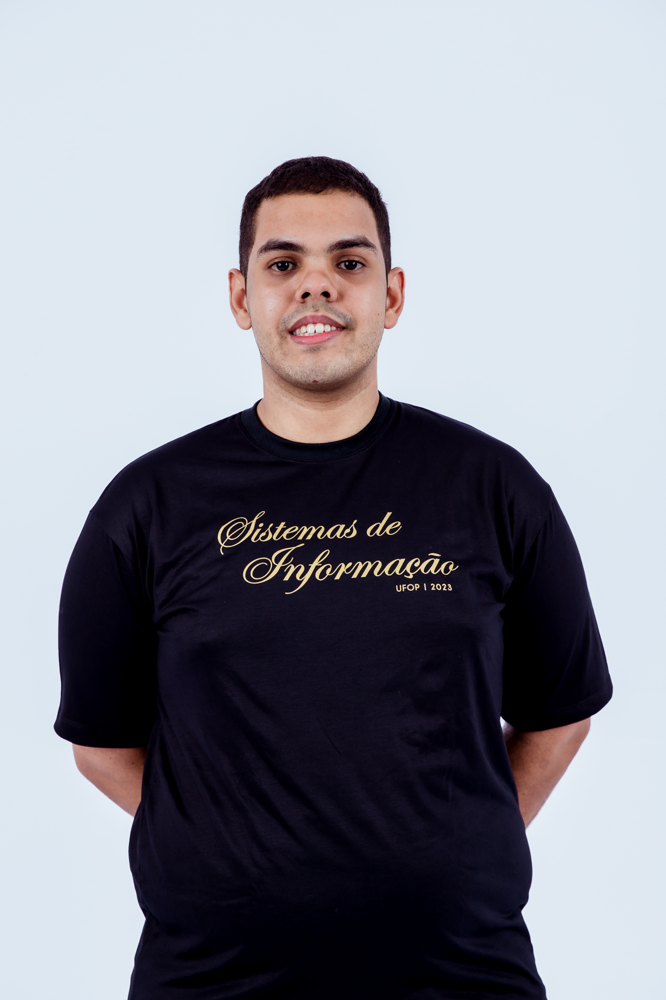

# Coffee Delivery App
Projeto desenvolvido como desafio para o **Nível 2: Aprofundando em Hooks** da trilha do Ignite - React da Rocketseat.


[📄 Sobre o Projeto](#-sobre-o-projeto) | [🧑‍💻  Tecnologias](#-tecnologias) | [🎨 Layout](#-layout) | [🚀 Como executar a aplicação](#-como-executar-a-aplicação) |
 [🤝  Como contribuir](#-como-contribuir) | [📝 Licença](#-licença) | [👥 Autor](#-autor)



## 📄 Sobre o projeto

O aplicativo gerencia um carrinho de compras para uma cafeteria fictícia e possui as seguintes funcionalidades:

[x] Listagem de produtos (cafés) disponíveis para compra

[x] Adicionar uma quantidade específicas de itens no carrinho

[x] Aumentar ou remover a quantidade de itens no carrinho

[x] Formulário para o usuário preencher o seu endereço

[x] Exibir o total de itens no carrinho no Header

[x] Exibir o valor total da soma de itens no carrinho multiplicados pelo valor

## 🧑‍💻 Tecnologias

- [TypeScript](https://www.typescriptlang.org/)
- [Vite](https://vitejs.dev/)
- [React](https://react.dev/)
- [React Router DOM](https://reactrouter.com/en/main)
- [React Hook Form](https://react-hook-form.com/)
- [Styled Components](https://styled-components.com/)
- [Zod](https://zod.dev/)
- [Phosphor React](https://phosphoricons.com/)
- [ESLint](https://eslint.org/)

## 🎨 Layout da aplicação

Você pode acessar o layout da aplicação pelo seguinte link:

- [Layout](https://www.figma.com/file/DccDGY4U5u96sBQZQtzsfg/Coffee-Delivery-%E2%80%A2-Desafio-React?type=design&node-id=2%3A12&mode=design&t=TH2uwxFmoDA7HJrf-1)

Lembrando que é necessário possuir uma conta no [Figma](https://www.figma.com/).

## 🚀 Como executar a aplicação

A aplicação está disponível online e pode ser acessada por esse [link](https://coffeedeliveryproject.netlify.app/).

Caso queira executar a aplicação em seu local, siga os seguintes passos:

- Clone esse repositório:

```
git clone https://github.com/andersondev96/desafio02-coffee-delivery-react
```

- Acesse a aplicação

```
cd desafio02-coffee-delivery-react
```

- Instale as dependências
```
npm install
```
- Clone o .env.example e renomeie para .env
```
cp .env.example .env
```
- Acesse o [Console do Google Cloud Platform](https://console.cloud.google.com/) e crie uma nova chave de API. Copie e colo no *VITE_GOOGLE_MAPS_API_KEY* do *.env*.

- Para executar a aplicação, execute os comandos:
```
npm run server && npm run dev
```

- Abra a aplicação no navegador de sua preferência.

 ## 🤝 Como contribuir?

- Faça um fork desse repositório.
- Crie uma branch com a sua feature: `git checkout -b my-feature`.
- Faça commit das suas alterações: `git commit -m 'feat: My new feature'`.
- Faça push para a sua branch: `git push origin my-feature`.

Depois que o merge da sua pull request for feito, você pode deletar a sua branch.

## 📝 Licença

Este projeto está sob a licença [MIT](LICENSE).

## 👥 Autor



**Anderson Fernandes Ferreira**

[](https://instagram.com/anderson_ff13)
[](mailto:andersonfferreira96@gmail.com.br)
[](https://www.linkedin.com/in/anderson-fernandes96/)

Feito com 💚 por Anderson Fernandes 👋 [Entre em contato!](https://www.linkedin.com/in/anderson-fernandes96/)
